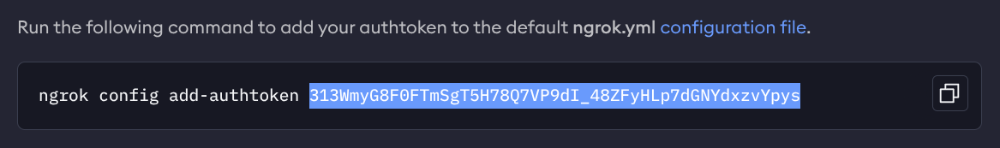
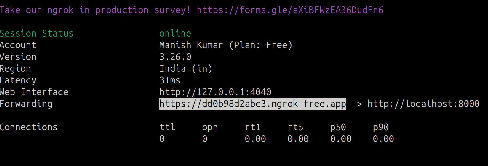

<<<<<<< HEAD
# Read this file everything will happen on its own.

`Note: try to use linux distro or install WSL(subsystem for linux) on windows for soomth running.`

## 🚀 Features
- Automatically installs dependencies from `requirements.txt`
- Installs ngrok if not already installed
- Starts `uvicorn` server
- Exposes your local server publicly via ngrok
- Clean shutdown with **Ctrl+C**
---

## 📦 Prerequisites
Make sure you have:
- **Python 3.8+** installed
- **pip** installed

---


## 🔑 Getting Credentials
1. **Google API Key**  
   Get your key here:  
   [https://aistudio.google.com/apikey](https://aistudio.google.com/apikey)

2. **ngrok Auth Token**  
   Register and get your token here:  
   [https://ngrok.com/](https://ngrok.com/)

   ## ONLY COPY SELECTED PART
   

---

## 🛠️ Installation: Just execute this file and enter your credentials

### 1. Make the script executable
```bash
chmod +x start.sh
```

### 2. Then run the script 
```bash
./start.sh
```


---

# Lastly copy paste the public url
Also don't forgot to add "/api" after the url.

- ### public link

eg: https://dd0b98d2abc3.ngrok-free.app


- ### Add "/api"

## Final link: public link + "/api"

eg:  https://dd0b98d2abc3.ngrok-free.app/api


=======
# project-data-analyst-api
TDS Project 2
>>>>>>> ec58eabb97f70edac301669c6006a879b9c22739
